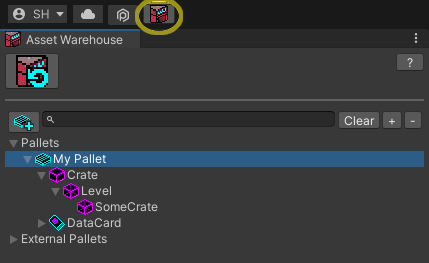

# Pallet Packing: Building a Mod

The Pallet Packing process bundles the contents of your Pallet into a usable mod format that can be installed locally into your Bonelab Mods folder or distributed to an online resource, like Mods.io or Thunderstore.

- Open the Asset Warehouse window if it is not already visible using the Asset Warehouse button in the upper-left of the Unity window or navigate to `Stress Level Zero → Asset Warehouse`.
- Select your working Pallet in the Asset Warehouse

-  In the Pallet's inspector window, click the <i>Pack Pallet</i> button to expand the `Pack for PC` and `Pack for Quest` buttons.  

# Installing Built Mods Locally to PC or Quest

### If the Pallet inspector detects that a mod has been built for the PC platform, a `Install for BONELAB on PC` button appears and will copy the packed pallet content to your game's MODs folder when clicked.

- To install on PC manually, once your Pallet is packed, a File Explorer window will appear.  Copy the folder ("AuthorName.PalletName") into your Bonelab `Mods` folder.  
   * The PC default is `C:\Users\[username]\AppData\LocalLow\Stress Level Zero\BONELAB\MODS`.  

(Click image to see its full-size version, use the browser Back button to return)

   * If installing locally to Quest 2, connect the headset with a Link cable, and then from within the headset, you must **Allow Files** from the connected device when prompted.  Meta requires you to perform this Allow confirmation every time the headset is plugged in to a PC.  On the PC, navigate to:  
   `This PC\Quest 2\Internal shared storage\Android\data\com.StressLevelZero.BONELAB\files\Mods` 
   and copy the folder generated during the Pack Pallet process to the Quest2 Mods direcotry.

- Launch the game and enter the Hub.  If you've already completed the game, you can simply enter the Mods menu and navigate to the level.
- Otherewise, Hold B or Y (Index) to bring up the in-game Menu.
- If the mod contained a level, you can enter it by selecting `Levels`, then selecting your custom map.
If the mod contained an Avatar, you can switch to it by selecting `Avatars`, and then selecting your custom avatar from the list.
If the mod included a `Spawnable` custom item, you can find the item in the Utility Gun's menus.

# Preparing a Packed Pallet for Distribution

Review the [Sharing Packed Content](./SharingPackedContent) guide to ensure your Marrow content is ready.