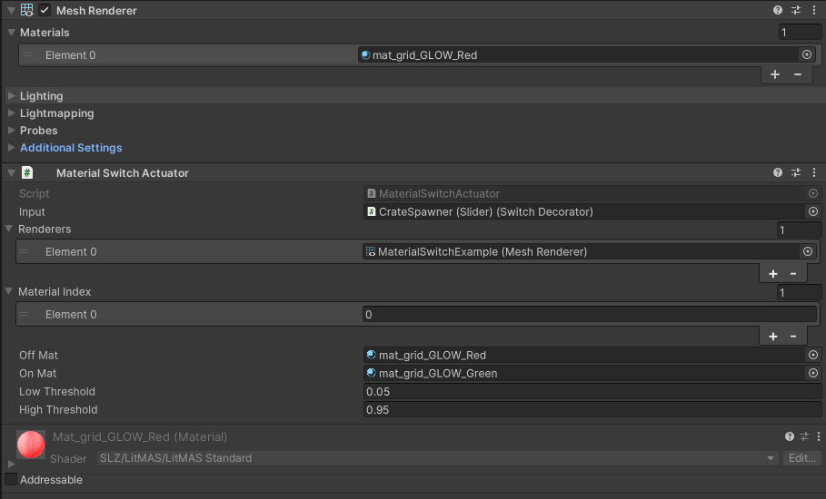
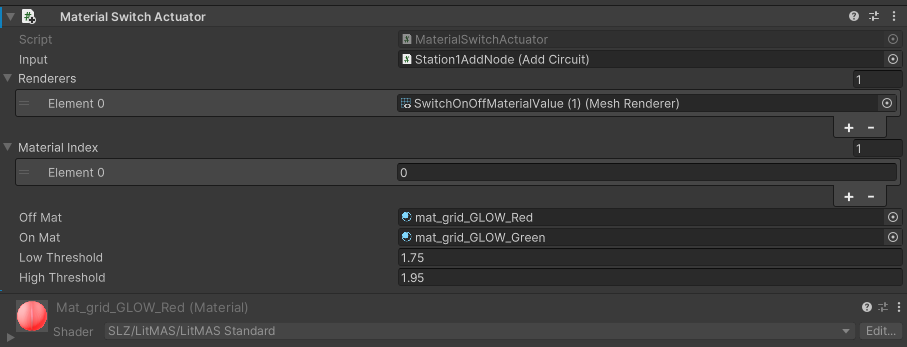
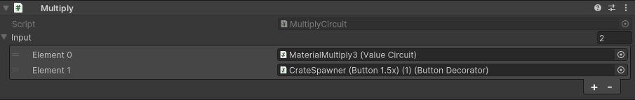

#  Fixtures

 <a href="https://slz.gg/fixtures">Fixtures Tutorial Video</a> 

## Fixtures

Fixtures can be easily added to a level by dragging and dropping the Fixture Datacard from the Asset Warehouse into the scene or hierarchy.  The Asset Warehouse also provides Drag-Drop functionality for Spawnables and will automatically create CrateSpawners when dropped into the scene.

Fixtures, like buttons, levers, switches and sliders, allow the player to interact with the Circuits system.  As a fixture is manipulated, its input signal is sent to other nodes, actuators or circuits and are used to trigger events and add dynamic responses to player actions.  Most fixtures come paired with an optional static geometry base.  This base is purely cosmetic and can be altered or removed at will.  The Cratespawner portion of the lever, button, slider or similar fixture object, along with its circuit Decorator components, are the operative pieces to a fixture.  
 
A fixture typically outputs a value between 0 and 1 based on its position.  This value can be increased beyond 1 using the Add, Multiply and Value Nodes.  Fixtures are used as inputs for Actuators.  

## Actuators

Actuators read the input signal provided by the fixture and respond by triggering an event, swapping a material on an object, etc.  Actuators have Low and High thresholds that must be reached in order to trigger a response.  

### Light Switch Example

 

To create a simple light switch, consider a Slider Fixture that is an Input to an Event Actuator.  The Event Actuator has an <i>Input Rose</i> listener that points to a gameobject with a disabled Light component.  The Input Rose listener is configured to enable the Light gameobject when triggered.  

 

If the switch begins in the low/off position and then is moved to its high/on position, its input signal increases.  If the slider is moved toward its high/on position, it will reach or exceed the Event Actuator's High Threshold and trigger the <i>Input Rose</i> events.  In this case, the Light GameObject will be enabled.  

To turn off the light, the same Light GameObject can be added to the <i>Input Fell</i> event listener with its light enabled property unchecked.  When the slider is moved back to its Low position the output signal falls below the Low Threshold, firing the Input Fell events, which disables the Light.

To ensure the light begins turned off, the Entity Pose in the Crate Spawner's Decorator is set to Slider - Down [0], which will ensure the Slider is in the lowest position upon spawning into the map.

## Event Actuator

The Event Actuator reads a signal from the Input circuit or Node and fires events based on the value.   
- <i>Input Updated</i> is an expensive listener and should be used with caution because all listener callbacks will be fired every time the Input value changes.   
- <i>Input Rose</i> triggers its events when the input signal meets or exceeds the High Threshold.  
- <i>Input Held</i> triggers its events while the input signal is sustained at or above the High Threshold.  
- <i>Input Fell</i> triggers its events when the input signal equals or falls below the Low Threshold.  
- <i>Input Rose OneShot</i> triggers its events only the very first time the input signal meets or exceeds the High Threshold.  

## Material Switch Actuator

The Material Switch Actuator reads a signal from the Input circuit or Node and swaps to the specified On material when the High threshold is met or the Off material when the Low threshold is reached.  Multiple Renderers can be specified in the Renderers list.  

If a Renderer has multiple materials, the Material Index list allows specific materials to be targeted for switching based on their material index. 

 

## Nodes

### <b>Add Node</b>  
 

The Add Node sums the values of the listed Input circuits and outputs the total. This node can be used as the Input circuit for a target node, circuit or actuator and the total sum input will be supplied to the target.  The target's threshold values should be adjusted for the appropriate total input.

 

### <b>Flipflop Node</b>  
 

The Flipflop Node uses a Set Input and a Reset Input to toggle between an output of 0 or 1.  When the Set Input reaches the Set Threshold, the Flipflop Node's outputs a value of 1.  When the Reset Input reaches the Reset Threshold, the Flipflop Circuit outputs a value of 0.

This allows two inputs to toggle a target circuit, where the Set Input acts as an On switch and the Reset Input acts as an Off switch.

 
 
 

### <b>Multiply Node</b>  
The Multiply Node multiplies the values of the listed Input circuits and outputs the total.  Since the default output of most fixtures is between 0 and 1, the Value Node can be used with the Multiply node to generate values where the product of the Value Node and the Fixture are greater than 1.  The Multiply Node can be used as the Input circuit for a target node, circuit or actuator and the total product input will be supplied to the target.  The target's threshold values should be adjusted for the appropriate total input.

 
 
 
 

In this example, each buttons is multiplied with a Value Node and then that total value is multiplied together and used as an Input for the Material Switch Actuator that has a High Threshold of 5.95.

 
 

In order for the buttons to generate values greater than 1, each button's output is multiplied by a constant Value Node.  Only when both buttons are activated will the total output of the series of Nodes reach or exceed the High Threshold of the Material Actuator and swap the large panel's material from red to green.

 
 

 
 

### <b>Value Node</b>  
The Value Node outputs the specified value and can be especially useful when paired with the Multiply and other math-operation Circuits.

### <b>Remap Node</b>  

 

The Remap Node translates the values of the input circuit to the specified curve, giving granular control over the output signal.  Several keys can be added to the curve, allowing several peaks and valleys to be sculpted along the curve.  The Remap Node maps the output signal to a curve where the position of the fixture along its travel path maps to the X-axis and the output value maps to the Y-axis.

 

In this example, as the slider is dragged from left to right, its input is translated as if traveling along the curve.  At the left-most position, the slider's output value is zero.  Moving the slider to the right, the output will climb to 1 after traveling only 1/10th of the total slide distance.  This will cause the Material Switch Actuator to swap from red to green.  The input value declines back down to zero after the slider has moved less than 3/10ths of the total slide distance.  This swaps the material back to red.  At the Slider's half-way point, the output value again climbs to 1 and the material swaps to green.  At roughly 3/4 of the total slide distance, the material will switch back to red.  As the Slider approaches the right-most edge, the signal ramps up to 1 and the Material Switcher will swap to green once more.  In short, a Remap curve allows the position of the Fixture along its travel path to determine the output value of the circuit.

 

### <b>Xor Node</b>  
  

The Xor Node only activates if an odd number of its inputs are active.

XOR = Off because there is an even number of Sliders in the up position. 

    

 XOR = On because there is an odd number of Sliders in the up position. 

   

