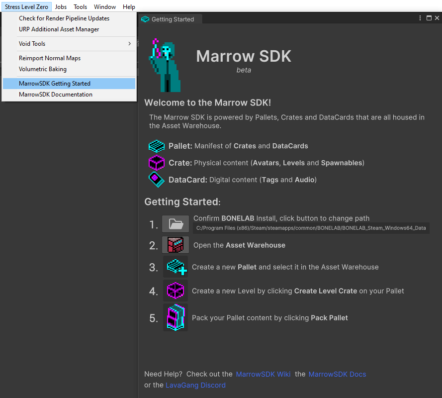

# MarrowSDK
Welcome to the MarrowSDK Wiki.  This is a public resource containing usage documentation for the MarrowSDK.

## Creating Marrow Content
- [Project Setup](ProjectSetup)
- [Getting Started](#getting-started)
- [Creating a Pallet / Crates / Datacards](PalletsAndCrates)
  - [Spawnable Crate](Spawnables) - Spawn vanilla Bonelab items with the Bonelab Spawnable Pallet, spawn custom items into levels
  - [Avatar Crate](Avatars) - Create and play as a custom avatar
  - [Level Crate](Levels) - Design a custom Bonelab level
  - [Bone Tag Data Card](BoneTags) - Digital data used to reference the Player and other items, used to organize crates, etc.
  - [Mono Disc Data Card](MonoDiscs) - Reference digital audio data
  - [Surface Data Card](SurfaceDataCards) - References digital surface data, controls the visual effects of surface impacts and includes physical material defaults

- [Zones](Zones)
  - [Zone Links](ZoneLinks)
  - [Zone Events](ZoneEvents)
  - [Zone Load Level](ZoneLoadLevel)
- [ZoneLinkItems](ZoneLinkItems)
  - [Zone Music](ZoneMusic)
  - [Zone Ambience](ZoneAmbience)
- [Impact Properties](ImpactProperties)
  - [Surface Painter Overlay](ImpactProperties#surface-painter-overlay)
- [Fixtures](Fixtures)

- [Pallet Packing / Mod Installation](BuildPallet)
- [Mod Repositories](ModRepositories)
- [Developer Mode](DeveloperMode)
- [UltEvents](UltEvents)
- [Sharing Packed Content](SharingPackedContent)

Project Setup
---
Watch the step-by-step <b>MarrowSDK [Project Setup Guide](https://www.youtube.com/watch?v=U5jynJcDjvo)</b>, the <b>[Getting Started Guide](https://www.youtube.com/watch?v=M4B0TOG-b94)</b> on YouTube or follow the written <b>[Project Setup](ProjectSetup)</b> guide.

Getting Started
---

- On first launch, until you've created a Pallet, the editor will display a <i>Getting Started</i> window that will guide you through ensuring the SDK has <i>automatically</i> detected your game installation folder.  If not, the Game Install Locator will provide several options to find it.

- Setting your game install will add the External BONELAB Content Pallet, which gives you access to all Bonelab vanilla content, like spawnables, avatars, the full game soundtrack and several ambient sounds that can be used when making your own content.

- Use the Asset Warehouse button in the upper left of the Unity window to display the Asset Warehouse whenever you need it. 

- Create a Working Pallet, select it in the Asset Warehouse and add a new Level Crate.
- The Default Marrow Scene will create a basic template that includes the essential components of a level, so you can focus on being creative!

