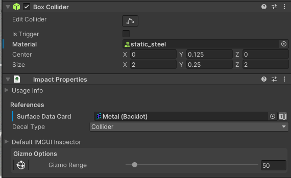
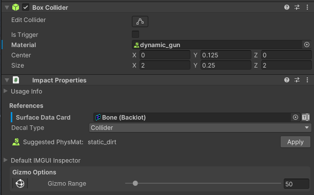
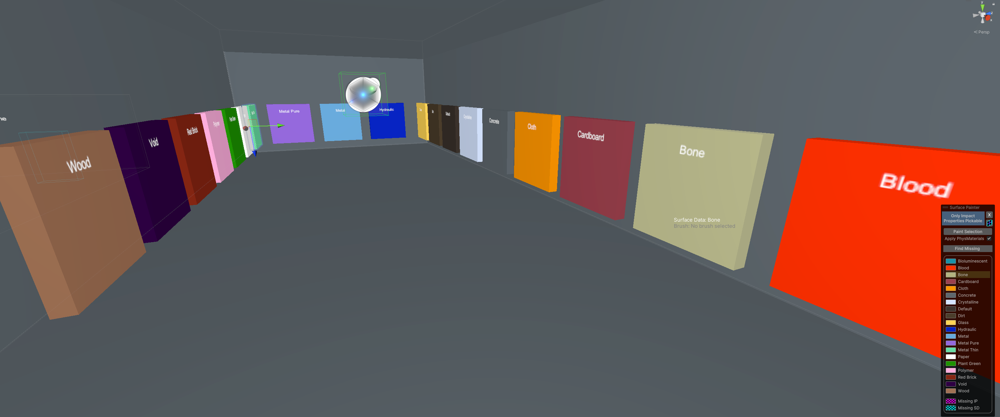
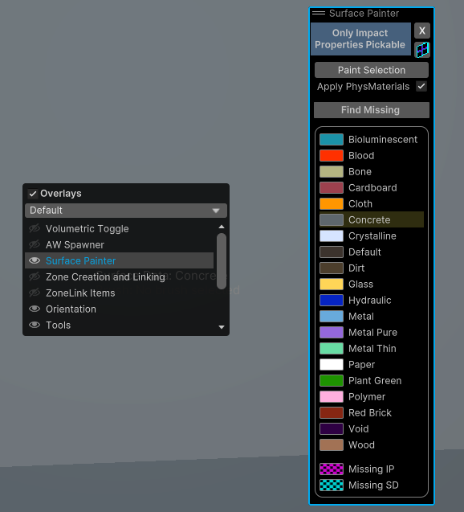
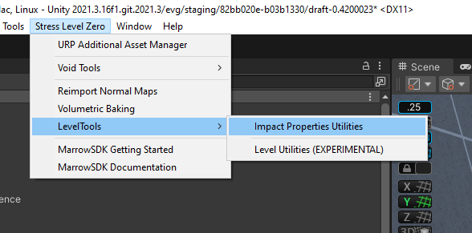
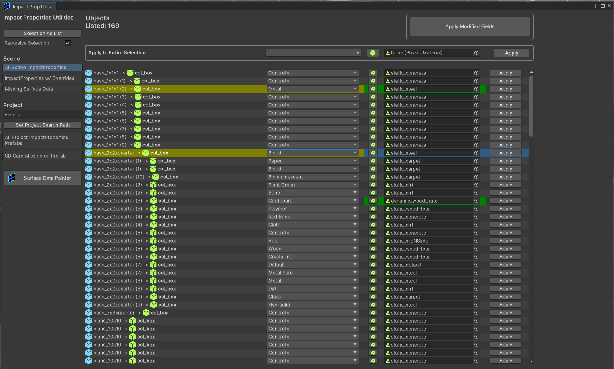

#  Impact Properties

#### Impact Properties use [Surface Data Cards](SurfaceDataCards) to add physical properties to colliders in the environment that control the visual effects and decals that occur when the surface is hit.  Impact Property components are typically found on static colliders objects or dynamic rigidbody objects.

Each Surface Data Card includes a suggested Physical Material that matches the Surface Data.  If the object's current Physical Material does not match the suggestion from the Surface Data Card, an option will appear showing the suggestion and a button to apply the suggested physical material.  However, Surface Data Cards do *not* need to match their physical material... BONELAB, for example, uses the carpet physical material for static Blood surfaces.

 

# Applying Surface Data to Impact Properties 

There are several tools that help populate a level with Impact Properties and Physics Materials.  If you prefer visual and spatial tools, the **Surface Painter** will enable an overlay that shows the surface data cards applied on any Impact Properties component in the scene.  This overlay can be enabled from the Unity Overlays menu (press spacebar with the Scene view in focus) or by clicking the *Gizmo Options* button at the bottom of any Impact Properties component.

## Surface Painter Overlay

 

When the Surface Painter overlay is active, only non-trigger colliders and a special ImpactPropertiesMeshGizmo component used to render the visualization will be pickable in the scene.  Any valid collider or rigidbody object that is missing an Impact Properties will show in a magenta checkerboard pattern.  

An Impact Properties component that is missing its Surface Data Card will appear as a cyan checkerboard pattern.

Otherwise, surfaces will be color-coded according to the legend in the Surface Painter overlay.  To update the Surface Data Card, select the object(s) in the scene or hierarchy, click a Surface Data Card from the list in the overlay, and then click Paint Selection.  This will update the selection with the chosen Surface Data Card, essentially allowing you to "paint" surface data information into your level.  If a surface is missing its Impact Properties component, "painting" it will add the component and then apply the desired Surface data.  

If the Apply PhysMaterials toggle is enabled (default), then painting also applies the suggested physical material for a surface.

A small button in the upper right of the Surface Painter Overlay allows you to quickly toggle the Impact Props Utils window (see below).

## Impact Properties Utils

 

 

The Impact Properties Utils window is an alternative way to apply Surface Data to your level.  It gathers all of the Impact Properties throughout a level into an extensive list.  From there, you can perform singular or mass-update operations in order to apply Surface Data.  Clicking on an item in the list will select that object in the hierarchy.  Any changes made will be highlighted and then must be confirmed with the Apply Modified Fields button to apply all current modifications.  Each change can also be applied manually using each field's Apply button.  

For mass-applications, you can select multiple objects in the list and then use the Apply to Entire Selection section of the tool.

The "Selection As List" button allows you to select any number of objects from the hierarchy or scene and then click the Selection As List to display any selected GameObjects that have Impact Properties as the active list in the Impact Properties Utils windnow.

A button in the lower-left of the window allows you to enable the Surface Painter and its visual overlay.