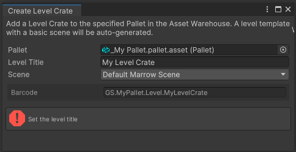

#  Level Crate

## Best Practices for Level Creation by SLZ Level Designer HappyGoCrazee
https://mod.io/g/bonelab/r/best-practices-for-level-creation

## Level Tutorial Video Series

 <a href="https://www.youtube.com/playlist?list=PLt3w6qMd_mSOGTEb9yPFW_9B2hD7sngTe">Zone Tutorial Video Playlist</a> 

- Workflow Recommendations - https://www.youtube.com/watch?v=KDCtmDReKd4
- Blender Geometry and Colliders - https://www.youtube.com/watch?v=NkLFEwJbedA

### Totally new to level building?  Start here:
- Blender Primer - https://www.youtube.com/watch?v=DIz6pxvKsQ8 (The 3D software route)
- ProBuilder Primer - https://www.youtube.com/watch?v=7RRTnimMZqU (Build geo directly in Unity)

### Levels Overview

Bonelab levels are a Unity Scene or collection of Scenes (see [Scene Chunks](SceneChunks)) that contain the geometry, textures, lighting, reflection probes, light probes, triggers, [Zones](Zones), [Zone Events](ZoneEvents), a myriad of [CrateSpawners](Spawnables), that range from items and weapons the player can use to enemy NPCs to fight.  In addition to lighting, a level's mood is often set through its music and ambient sounds.  Zone Link Items, like [Zone Music](ZoneMusic) and [Zone Ambience](ZoneAmbience), coupled with Reverb data and Reverb Zones, provide the means to texture a level with a rich audio landscape.  Each level must contain one [Player Marker](PlayerMarker), which acts as its spawn point.

## Create a Level Crate

- Select your `Working Pallet` in the Asset Warehouse.  
- In the Pallet's inspector, click the `Create Level Crate` button.  

- In the `Create Level Crate` window that appears, set the `Level Title`.  

Leaving the other options as defaults, this will auto-generate a basic Unity Scene from the Marrow Scene Template that includes all of the basic essentials for a level, including lighting, light probes, Reflection Probes, Zones, Baked Volumetric Fog and the Player Marker.  This serves as a good starting point allowing you to focus on adding geometry, lighting, sound, music, spawnables and other creative aspects level design.

If you already have a .unity scene file that you want to the Level Crate to use, you can use the drop-down menu to select `Custom Scene` and then set the Scene field that appears.

- Click `Create`

Most Arena-style levels or small levels will work fine as single scene levels.  However, building a custom campaign level with large amounts of environmental detail that may span enormous areas should leverage the [Scene Chunks](SceneChunks) system that dynamically streams in and out additive scenes based on the player's location.  This allows for much greater fidelity and has significant performance benefits.