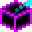
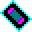
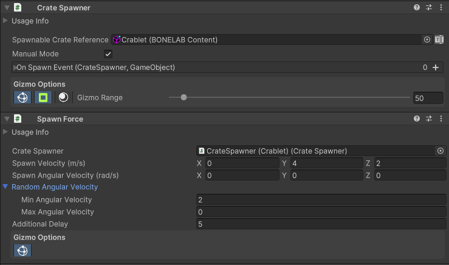
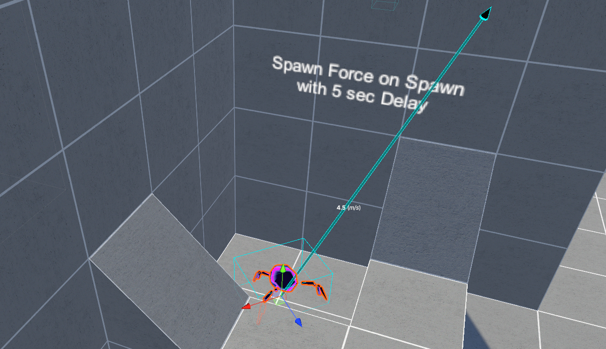

#  Spawn Force

 <a href="https://www.youtube.com/watch?v=xPDfccK1Cns">Zone Aggro and Spawn Force Tutorial Video</a> 

Adds a force impulse to an entity.  By default, the force is applied when the entity spawns from the Crate Spawner.

**Advanced**: If needed, you can disable *Apply Force On Spawn* to allow the force to be triggered with a Zone Event that calls ApplyForce() after the entity is awakened. If this option is not visible in the inspector, use Unity's Debug Inspector mode to access it.

 

Spawnforce allows you to set the direction and magnitude of the impulse that gets applied to the spawned entity.  You can also apply an angular force to the spawned object so that it spins or tumbles through the air.  You can even make this angular velocity a random value and simply set the min and max limits.  As you alter the velocity values, velocity text and arrow indicators will be drawn in the scene to help guide setting the desired direction and rotation values.

