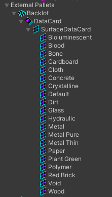
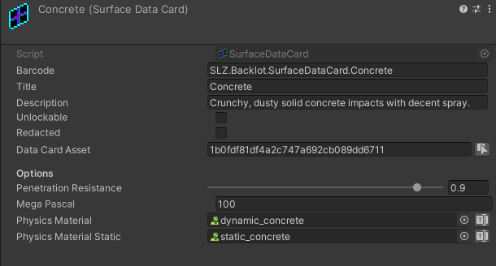

#  Surface Data Card

Surface Data Cards hold references to physical materials that define the visual effects that appear when the surface is hit.  Surface Data Cards include static and dynamic physical materials, define penetration resistance values for the surface, and MegaPascals, a unit of pressure, which determines properties like the surface's stiffness or tensile strength.  

 