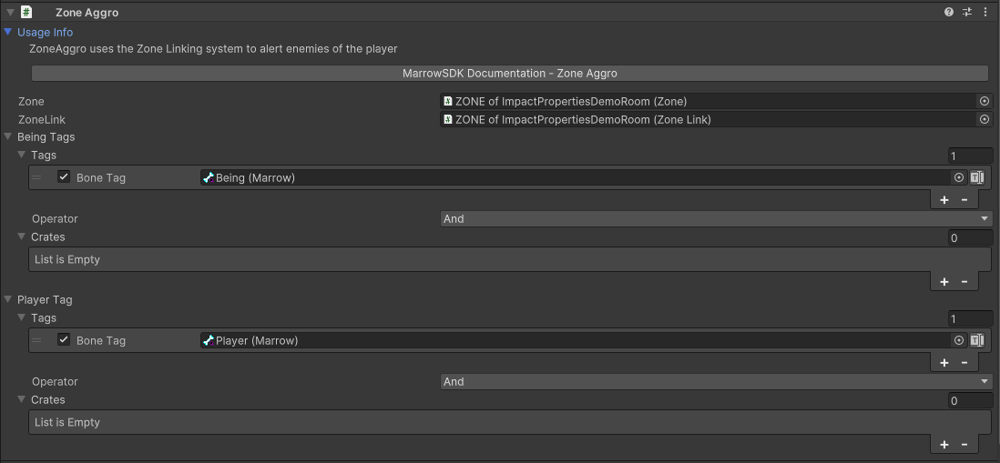

#  Zone Aggro

 <a href="https://www.youtube.com/watch?v=xPDfccK1Cns">Zone Aggro and Spawn Force Tutorial Video</a> 

The Zone Aggro component uses the Zone Linking system to alert enemies of the player when they enter the current zone.  The Being Tags and Player Tags lists provide additional filtering options for trigger events.

