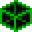

#  Zone Culler

 <a href="https://www.youtube.com/watch?v=u9z4fNoYrY0">Scene Chunks Tutorial Video</a> 

## Linked Zones with Zone Culler Components

<b>Zone Cullers</b> are part of the Zone Linking system and manage the entities and beings within their bounds so that they can be frozen and hidden whenever the Zone is deactivated.  

## Linked Zones with Zone Culler and Zone Chunk Loader Components

<b>Zone Cullers</b> handle additional functions in multi-scene levels that employ the Scene Chunks system.  Zone Cullers listed in the Scene Chunk component define the areas that should be culled as the scene is streamed out.  Spawned entities being tracked by these culled Zones are frozen, freeing up physics and AI performance.  Static geometry, lighting and other scene contents are also hidden, freeing up rendering resources.
